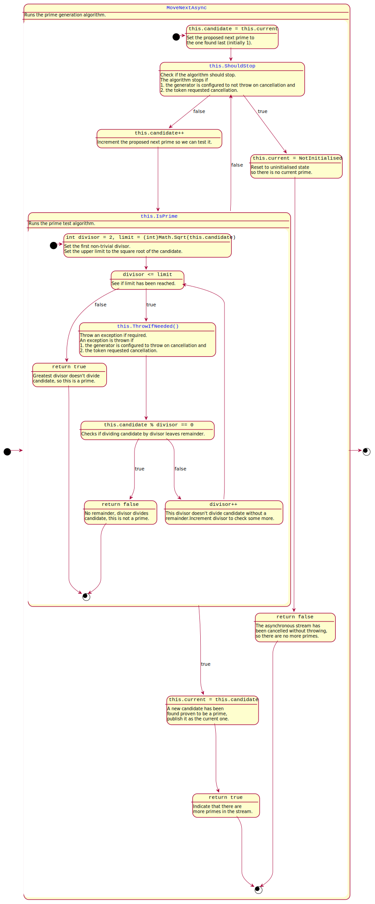

# Class library

This folder contains a .NET Core 3 class library project.

## Architecture

- [PrimeGenerator](./PrimeGenerator.cs) produces an asynchronous stream prime numbers. 
- [AsyncEnumerator](./PrimeGenerator.AsyncEnumerator.cs) is the state-machine that does the actual work.
- [MultiplicationTable](./MultiplicationTable.cs) produces an asynchronous stream of rows of a multiplication table, each an asynchronous stream of multiplication results

## Prime generator algorithm

